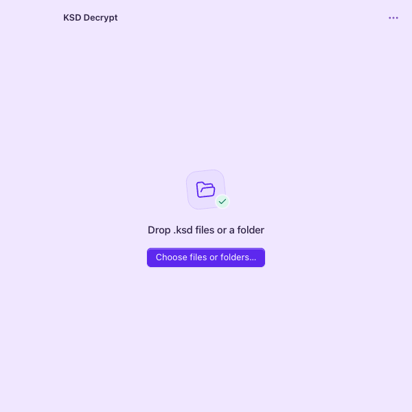

# KSD Decrypt

[**Download the latest release**](https://github.com/sitapix/ksd-decrypt/releases/latest) · [Mac](https://github.com/sitapix/ksd-decrypt/releases/latest/download/KSD-Decrypt-macOS-universal.dmg) · [Windows](https://github.com/sitapix/ksd-decrypt/releases/latest/download/KSD-Decrypt-Windows-x64-setup.exe)

[](https://buymeacoffee.com/sitapix)

KSD Decrypt is a desktop app for recovering photos and videos from **legacy Android KeepSafe `.ksd` files**. Select a backup and supported files recover automatically on your computer, with the originals left untouched. No account, PIN, upload, or programming knowledge is required to use the app.

Built with Tauri 2, Rust, and a framework-free TypeScript interface for Mac and Windows. KSD Decrypt is independent of KeepSafe and is not affiliated with or endorsed by it.

<picture>
  <source media="(prefers-color-scheme: dark)" srcset="docs/screenshots/ksd-decrypt-dark.png">
  
</picture>

*Interface preview. Native window controls and translucency vary by platform.*

**Project status:** GitHub Actions builds universal Mac and Windows x64 installers for tagged releases. Installers are unsigned or ad-hoc signed; native installation and recovery still need verification on each target system.

## Features

- Add individual files or recursively scan backup folders using native pickers or drag and drop.
- Save recovered copies beside their originals, or choose a separate output folder.
- Preserve recovered media bytes without conversion or recompression.
- Keep existing files and reports: conflicting names receive numbered suffixes.
- Stop recovery safely, keep completed copies, and retry unfinished files.
- Search and page through large file lists, then open or reveal recovered files.
- Save local JSON recovery reports with results, file paths, and SHA-256 hashes.

Recovery makes no network requests and streams files in 1 MiB chunks. There is no app-imposed file-size or batch-count limit; available storage and filesystem limits still apply.

## Installation

### Requirements

| Platform | Target requirements                                                                                  |
| -------- | ---------------------------------------------------------------------------------------------------- |
| Mac      | macOS 12.3 or later; the universal build includes Apple silicon and Intel.                           |
| Windows  | 64-bit Windows 10/11 with Microsoft WebView2; the installer includes the offline WebView2 installer. |

These are the configured build targets. They do not establish that every platform has been runtime-tested. The operating system and WebView2 manage their own updates.

### Install a desktop build

Open [the latest release](https://github.com/sitapix/ksd-decrypt/releases/latest) and download the installer for your computer:

- **Mac:** [download the universal DMG](https://github.com/sitapix/ksd-decrypt/releases/latest/download/KSD-Decrypt-macOS-universal.dmg), open it, copy **KSD Decrypt** to **Applications**, and launch it. The same download supports Apple silicon and Intel.
- **Windows:** [download the x64 installer](https://github.com/sitapix/ksd-decrypt/releases/latest/download/KSD-Decrypt-Windows-x64-setup.exe), run it, and launch **KSD Decrypt**. It installs for the current user.

Each release includes `SHA256SUMS.txt` to verify the downloads. Choose an installer from **Assets**, rather than GitHub's source-code archives. Download links become available when the first stable release finishes building. You can also [build installers locally](#build-installers).

Platform trust warnings are expected for unsigned or ad-hoc-signed development builds. End users do not need Node.js, Rust, or Python.

## Usage

1. Open **KSD Decrypt** and click **Choose files or folders…**, or drag files and folders onto the window. On Mac, one picker accepts both files and folders, including multiple selections. On Windows, choose Files or Folders first.
2. Recovery starts automatically for supported files. By default, each copy saves beside its original, even when the selected files come from different folders. Other file types are skipped; adding the same source path again does not duplicate it.
3. Click a recovered filename to open it in your system's default viewer, or click its folder button to reveal it.

For example, recovering `Holiday.jpg.ksd` with the default destination produces:

```text
Backup/
├── Holiday.jpg.ksd          Original, unchanged
├── Holiday.jpg              Recovered copy
└── KSD Decrypt report.json   Local recovery report
```

If `Holiday.jpg` already exists, the new copy becomes `Holiday (2).jpg`. Output names use the detected media format, remove legacy 13-digit timestamp prefixes, and replace characters that are invalid in portable filenames.

### Choose where copies are saved

Use **More → Output folder…** to select a destination before adding files, or to change the destination for future copies. Changing it also retries unfinished files; completed copies stay where they were saved.

A custom destination receives a separate `KSD Decrypt recovery <timestamp>` folder for each run. Results are grouped into **Photos**, **Videos**, **Thumbnails**, or **Additional images**, with one recovery report in that run's folder. With the default destination, reports are saved beside the sources in each affected folder.

### Stop, retry, or start over

- **Stop recovery** keeps completed copies and removes the unfinished temporary file. Use **Continue** or **Retry** to attempt unfinished files again.
- **More → Start over** clears the current list and restores the default destination. Saved files remain on disk.
- Closing the app during recovery prompts you to stop; the app waits for recovery cleanup before closing.

## Compatibility

Support is limited to the legacy Android KeepSafe layout containing a 3,705-byte PNG cover, a 16-byte IV, a type byte, and AES-256-CTR content encrypted with the original built-in key. Newer vault formats, different keys, and unrelated `.ksd` formats are unsupported. A `.ksd` extension alone does not establish compatibility.

Files are identified by their decrypted contents. Recognized media families include:

| Images                                                                                                      | Videos                                                                            |
| ----------------------------------------------------------------------------------------------------------- | --------------------------------------------------------------------------------- |
| JPEG/JPEG 2000, PNG, GIF, WebP, BMP, TIFF, ICO, HEIC/HEIF, AVIF, JPEG XL, PSD, and several camera RAW types | MP4/M4V, MOV, 3GP/3G2, WebM, MKV, AVI, MPEG, WMV, FLV, and MPEG transport streams |

Recognition does not guarantee support for every variant. JPEG structure, PNG CRCs, and ISO media box boundaries receive additional checks; other formats receive signature checks only.

The legacy encryption has no authentication tag, so structural validity cannot guarantee that every frame or pixel is intact. Keep your originals and inspect important recovered media. Playback also depends on the codecs available on your system.

## Troubleshooting and support

Open **More → Help** for a quick reminder of output locations and compatibility.

| Problem                                   | What to check                                                                                                                        |
| ----------------------------------------- | ------------------------------------------------------------------------------------------------------------------------------------ |
| No `.ksd` files found                     | Select the backup files or a folder containing them. Other extensions are skipped.                                                   |
| Unsupported format, key, or vault version | Confirm that the files use the supported legacy layout. Changing the output folder cannot add support for a different format or key. |
| Cannot save here                          | Choose a writable destination using **More → Output folder…**. Unfinished files retry automatically. Check available storage.        |
| A large file cannot be saved              | Check the destination filesystem. FAT32 cannot store an individual file of 4 GiB or more.                                            |
| A recovered file will not open            | Try a viewer that supports its format and codec. Recovery does not convert media or guarantee complete media integrity.              |
| A report could not be saved               | Check the reported folder's permissions and free space. A report-write failure does not remove completed recovered copies.           |

Report problems through [GitHub Issues](https://github.com/sitapix/ksd-decrypt/issues). Include the app version, operating system, exact error, and steps to reproduce it. Reports contain local file paths; redact personal information before sharing them, and use synthetic examples instead of private media where possible.

## Development

### Set up and run

Install Node.js 22 or later with npm, a current stable Rust toolchain, and the [Tauri prerequisites for your platform](https://v2.tauri.app/start/prerequisites/). These include Xcode or its command-line tools on Mac, and Microsoft C++ Build Tools, the MSVC Rust toolchain, and WebView2 on Windows.

From the project root:

```sh
npm ci
npm run dev
```

`npm run dev` builds the frontend and starts the native Tauri app. `npm run build` checks TypeScript and writes the bundled interface to `dist/`; it does not produce a desktop installer. Opening that interface in a browser shows a preview with native recovery actions disabled.

### Build installers

On macOS, install both Rust targets for the universal app:

```sh
rustup target add aarch64-apple-darwin x86_64-apple-darwin
npm run build:mac
```

On 64-bit Windows with the MSVC toolchain:

```sh
npm run build:windows
```

Build outputs appear under `src-tauri/target/`, with installers in the relevant `bundle/dmg/` or `bundle/nsis/` directories. For cross-compilation from macOS, see [Tauri's Windows build guide](https://v2.tauri.app/distribute/windows-installer/); verify the result on Windows before distribution.

The [GitHub Actions workflow](.github/workflows/build.yml) runs checks on pull requests and default-branch pushes. Mac and Windows run in parallel, with npm and Rust dependency caches. Documentation-only changes run lightweight workflow and version checks; new commits cancel stale branch/PR runs. Manual runs also build both installers as artifacts retained for 14 days. Pushing a matching version tag builds both installers and publishes them together as a GitHub release. See [CI and release details](docs/ci.md).

### Run checks

UI tests require Google Chrome. If it is not installed, run `npx playwright install chrome`. Then run:

```sh
npm run format:check
npm run fmt:check
npm run lint:rust
npm test
npm run build
npm run test:ui
```

`npm run build` must precede UI tests so they use the current interface. To format frontend changes, run `npm run format`; for Rust, run `cargo fmt --manifest-path src-tauri/Cargo.toml`.

The Rust tests use 19 synthetic image/video fixtures encrypted independently with Python `cryptography`. They verify plaintext hashes, source preservation, output locations, cancellation cleanup, duplicate-name protection, read-only folders, report preservation, malformed inputs, and portable filenames. The fixtures contain no personal media.

Playwright tests use mocked native commands. They exercise automatic recovery, destination changes, retries, cancellation, large byte counts, search and pagination, compact windows, keyboard interaction, and automated accessibility checks. Native pickers, platform behavior, and real media playback still need testing in the desktop app.

### Optional large-file check

This check requires Python 3.11 or later, the Python `cryptography` package, and at least 10 GiB of free temporary storage. After installing those prerequisites:

```sh
cargo build --release --manifest-path src-tauri/Cargo.toml --example ksd-decrypt-cli
python3 tests/large-file.py src-tauri/target/release/examples/ksd-decrypt-cli
```

On Windows, use your Python 3 command and append `.exe` to the CLI path. The script creates an MP4 with a padding box that takes it beyond 4 GiB, encrypts it independently, recovers it through the app's engine, and verifies the source and recovered hashes. Temporary files are removed afterward. This checks large-file I/O, not long-duration playback.

### Project structure

| Path                                                    | Purpose                                                                           |
| ------------------------------------------------------- | --------------------------------------------------------------------------------- |
| `src/app.ts`                                            | Interface state and recovery flow.                                                |
| `src/native.ts`                                         | Typed Tauri commands and per-recovery event channels.                             |
| `src/view.ts`, `src/motion.ts`                          | DOM access and interface animation.                                               |
| `src/index.html`, `src/style.css`                       | Interface markup and styles.                                                      |
| `src-tauri/src/commands.rs`, `picker.rs`, `session.rs`  | Native commands, input pickers, and session state.                                |
| `src-tauri/src/selection.rs`, `batch.rs`, `recovery.rs` | Input inspection, batch/report handling, and streaming decryption and validation. |
| `tests/fixtures/`, `src-tauri/tests/`, `tests/ui/`      | Synthetic fixtures, Rust integration tests, and browser UI tests.                 |
| [.github/workflows/build.yml](.github/workflows/build.yml) | Platform checks, installer builds, and tagged releases.                          |

Interface icons use [Lucide](https://lucide.dev/guide/lucide), with the seven selected icons registered in `src/icons.ts`. Static controls and dynamically created result rows share the same icon helpers. Icons are bundled locally with the app.

File I/O runs on blocking workers outside the session lock. A shared operation reservation prevents selection, reset, destination changes, and recovery from overlapping. Only the main window receives the app's explicit command permissions; the webview has no general filesystem, dialog, opener, or recovered-media protocol access.

## Contributing

Keep proposed changes focused. Explain the behavior they change, provide reproduction steps or a synthetic fixture where appropriate, and run the relevant checks above. Call out any changes to recovery compatibility or distribution requirements.

Preserve read-only access to originals, protection against output overwrites, local recovery, and safe cancellation. Keep compatibility claims tied to the implementation and test evidence.

## Release preparation

Keep the version in `package.json`, `package-lock.json`, `src-tauri/Cargo.toml`, `src-tauri/Cargo.lock`, and `src-tauri/tauri.conf.json` in sync. Commit the release changes, then push a matching tag, for example:

```sh
git tag v1.0.0
git push origin v1.0.0
```

The workflow rejects mismatched versions, runs the full checks, builds both platforms, and publishes the release only after both installers are present. Tags such as `v1.1.0-rc.1` produce prereleases without replacing the stable download. Published assets are left unchanged on reruns.

For public distribution, sign and notarize the Mac app with a Developer ID, sign the Windows executable and installer, and test each installer on its target operating system. A passing build alone does not establish a tested Windows release.

The Mac window uses AppKit vibrancy through Tauri's private transparency API. The current configuration targets direct distribution; a Mac App Store build would need to remove that API. App bundles contain the interface and executable, not test fixtures or recovered files.

## License

No project license file or licensing terms are included in this checkout. Dependency licenses are separate from the licensing of KSD Decrypt itself.

The build includes Lucide's ISC and Feather-derived MIT license notices in `dist/lucide-LICENSE.txt`, which is bundled with the desktop app. See the [Lucide license](https://lucide.dev/license).
